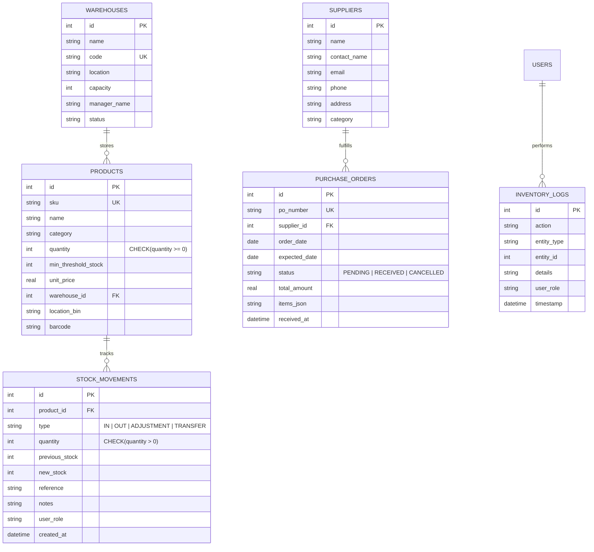

# Smart Inventory & Warehouse Management System (WarehousePro)

A professional, full-stack Smart Inventory and Warehouse Management System engineered with **React.js**, **Node.js + Express.js**, and a persistent **SQLite** relational database with strict ACID transactional integrity and zero-negative stock enforcement.

---

## 📑 Table of Contents
1. [Project Overview](#-project-overview)
2. [Tech Stack](#-tech-stack)
3. [Key Features & Capabilities](#-key-features--capabilities)
4. [User Roles & Access Permissions](#-user-roles--access-permissions)
5. [Database Architecture & Schema](#-database-architecture--schema)
6. [API Endpoints Summary](#-api-endpoints-summary)
7. [Installation & Setup Guide](#-installation--setup-guide)
8. [Running the Application](#-running-the-application)
9. [Bonus Enhancements Implemented](#-bonus-enhancements-implemented)
10. [Evaluation & Testing Workflow](#-evaluation--testing-workflow)

---

## 🚀 Project Overview

Warehouses require highly resilient systems to track inbound purchase shipments, outbound customer fulfillments, real-time product availability across multi-facility depots, and automated supplier workflows.

**WarehousePro** provides an end-to-end inventory management system with:
- SQLite as the single source of truth with Write-Ahead Logging (WAL) and foreign key constraints.
- Atomic transactions that **strictly prevent negative stock levels**.
- Live real-time stock movement simulation for IoT/barcode tracking.
- Multi-warehouse capacity and location bin tracking.
- Automated Purchase Order auto-stocking upon receipt.
- Algorithmic and predictive restocking analytics with run-rate burn velocity forecasting.

---

## 🛠 Tech Stack

| Layer | Technology | Details |
|---|---|---|
| **Frontend** | React 19, JavaScript (ES6+), HTML5, Vanilla CSS Design System | Responsive, clean enterprise slate UI, Lucide icons |
| **Backend** | Node.js (v24+), Express.js | Modular controllers, middleware, input validation |
| **Database** | SQLite3 (`better-sqlite3`) | Persistent relational database with WAL mode, foreign keys, & transactional rollbacks |
| **Build Tool** | Vite | Ultra-fast HMR and optimized production bundle |

---

## ✨ Key Features & Capabilities

1. **Executive Inventory Dashboard**
   - Live KPI widgets: Total Stock Units, Total Valuation ($), Low Stock Alerts, Out of Stock Counter, Active Warehouses.
   - Critical low-stock warning feed with 1-click replenishment action.
   - Real-time stock movement ledger.
   - Regional warehouse capacity utilization meters.
   - Inventory category breakdown.

2. **Product Master & Catalog Management**
   - Full CRUD support with SKU, Category, Price, Min Threshold, Location Bin, and Barcode.
   - Real-time multi-filter by Category, Stock Level (`In Stock`, `Low Stock`, `Out of Stock`), and Warehouse.
   - Search across SKU, Name, Barcode, and Bin designations.
   - Safe deletion prevention (blocks deleting items with active inventory).

3. **Stock Movements & Zero-Floor Safeguard**
   - **Stock IN (Intake)**: Increments stock, records reference number and audit log.
   - **Stock OUT (Dispatch)**: Strictly enforces non-negative constraints. Throws an explicit rejection if requested deduction exceeds available quantity.
   - **Inter-Facility Stock Transfer**: Relocate products between warehouses or shelf bins.
   - **Export Movement Ledger to CSV**: Instant download for external audits.

4. **Suppliers & Purchase Order Lifecycle**
   - Vendor directory management.
   - Interactive PO Builder with dynamic line items and auto-calculated total cost.
   - **Auto-Stocking Upon PO Receipt**: Clicking *Receive & Auto-Stock* executes an atomic transaction that adds inventory to SQLite, records Stock IN movements, and marks the PO as RECEIVED.

5. **Multi-Warehouse & Location Bin Tracking**
   - Real-time capacity utilization gauges.
   - SKU location bin tags (e.g. `Zone A, Shelf 14, Rack 2`).
   - Facility manager records and contacts.

6. **Reports & Predictive Analytics**
   - **Valuation Report**: Catalog-wide valuation broken down by SKU and category.
   - **Low Stock & Reorder Plan**: Calculates suggested reorder quantities to restore 2x safety buffers and calculates required purchasing capital.
   - **Predictive Restocking Engine**: Analyzes consumption burn rate over historical transactions to forecast stockout runways (days remaining) and generate proactive purchasing suggestions.
   - **Immutable Audit Trail**: Logs every action, entity, timestamp, and user role.

7. **Barcode Scanner Terminal Simulation**
   - Optical laser target simulation for quick barcode lookup.
   - 1-click intake/dispatch straight from the terminal.
   - Printable shelf inventory barcode label preview.

---

## 👥 Authentication, Real-Time Google SSO & Dynamic Role Data Scopes

The system includes a dedicated **Real-Time Authentication & Registration Screen** (`/auth`) with Google OAuth 2.0 integration and a dynamic **Role Switcher** in the top navigation bar.

### 1. Real-Time Google Authentication & Authorization:
- **Sign in with Google Account**: One-click Google Identity flow with pre-configured accounts or any custom Google email.
- **Auto-Provisioning**: Automatically verifies and stores Google accounts in SQLite (`users` table) with verified badges, profile avatars, and role authorization.
- **Session Matching**: Matches Google accounts with existing roles and authorizations.

### 2. Dynamic Role-Aware Data Scoping:
Whenever the user changes their role (Admin / Manager / Staff) in the header, **all page data, KPI scopes, and operational permissions update dynamically in real time**:

| Role | Scope & Dynamic Data Adaptations | Demo Credentials |
|---|---|---|
| **Admin** | **Executive Global Scope**: Complete multi-warehouse visibility, total enterprise valuation metrics ($82,000+), catalog administration, warehouse registration, supplier controls, and system database reset. | `admin` / `admin123` or `sarah.jenkins@gmail.com` |
| **Warehouse Manager** | **Facility & Procurement Scope**: Focuses on inventory replenishment buffers, low stock reorder priorities, supplier purchase order intake & receiving, and regional facility capacity utilization meters. | `manager` / `manager123` or `david.miller@gmail.com` |
| **Staff** | **Floor Execution & Scanning Scope**: Focuses on rapid Stock IN / Stock OUT dispatch queues, optical barcode scanner terminal shortcuts, bin storage lookups, and immediate task movements. | `staff` / `staff123` or `alex.rodriguez@gmail.com` |

---

## 🗄 Database Architecture & Schema

The SQLite schema resides at `backend/src/db/schema.sql` and includes the following tables:



---

## 🔌 API Endpoints Summary

### Products & Catalog
- `GET /api/products` - List products with multi-filter (search, category, stock level, warehouse).
- `GET /api/products/:id` - Detailed product info with recent movement ledger.
- `POST /api/products` - Register a new product item.
- `PUT /api/products/:id` - Update product details.
- `DELETE /api/products/:id` - Delete product (requires quantity = 0).

### Stock Movements
- `POST /api/stock/in` - Record inbound stock intake.
- `POST /api/stock/out` - Record outbound stock dispatch with zero-floor check.
- `POST /api/stock/transfer` - Relocate stock to another warehouse or bin.
- `POST /api/stock/adjust` - Reconcile inventory count with reason.
- `GET /api/stock/movements` - Query stock transaction ledger with filters.
- `POST /api/stock/simulate-live-event` - Automated IoT telemetry intake trigger.

### Suppliers & Orders
- `GET /api/suppliers` - List suppliers with active order counts.
- `POST /api/suppliers` - Register new supplier.
- `GET /api/orders` - List purchase orders with line items.
- `POST /api/orders` - Generate purchase order.
- `POST /api/orders/:id/receive` - Receive PO and auto-update SQLite stock.
- `PUT /api/orders/:id/cancel` - Cancel purchase order.

### Warehouses & Dashboard
- `GET /api/warehouses` - List warehouses with computed utilization rates.
- `GET /api/warehouses/:id` - Warehouse inventory breakdown.
- `POST /api/warehouses` - Create new warehouse facility.
- `GET /api/dashboard/summary` - Comprehensive KPI metrics and live alerts.

### Reports & Predictive Restocking
- `GET /api/reports/valuation` - Inventory valuation by SKU and Category.
- `GET /api/reports/low-stock` - Low stock and reorder plan.
- `GET /api/reports/predictive-restock` - Burn rate velocity and runway forecast.
- `GET /api/reports/audit-logs` - System audit log trail.
- `POST /api/system/reseed` - Reset and reseed demo database.

---

## 💻 Installation & Setup Guide

### Prerequisites
- [Node.js](https://nodejs.org/) v18.0 or higher
- [npm](https://www.npmjs.com/) v9.0 or higher

### 1. Clone the repository
```bash
git clone <your-repository-url>
cd warehouse_pro
```

### 2. Install Dependencies
Install all backend and frontend dependencies with a single command:
```bash
npm run install-all
```
*(Or individually: `cd backend && npm install`, `cd ../frontend && npm install`)*

### 3. Seed Database
Initialize SQLite database with a realistic baseline dataset:
```bash
npm run seed
```

---

## 🏃 Running the Application

### Development Mode (Concurrent Backend + Frontend)
Run both the Node.js Express server (port 5000) and Vite React frontend (port 5173):
```bash
npm run dev
```

- **Frontend Application**: `http://localhost:5173`
- **Backend API**: `http://localhost:5000`
- **API Health Check**: `http://localhost:5000/api/health`

### Production Mode
To build the frontend and serve it directly from Express:
```bash
npm start
```
Then access `http://localhost:5000` in your browser.

---

## 🌟 Bonus Enhancements Implemented

1. **Barcode Scanning Simulation & Label Preview**
   - Optical laser target viewfinder with quick scan input.
   - Instant 1-click Stock IN / Stock OUT from the terminal.
   - Printable warehouse shelf inventory label.

2. **Live Telemetry & Stock Tracking Stream**
   - Toggleable live IoT simulation in the top navbar.
   - Periodically triggers background intake/dispatch events that update the dashboard and stock ledger in real-time.

3. **Predictive Restocking Intelligence Engine**
   - Evaluates outbound transaction velocity to compute daily burn rates.
   - Projects runway days remaining before stockout.
   - Generates algorithmic reorder quantity recommendations.

4. **1-Click Demo Reseed**
   - "Reset Demo Data" button in the navigation header allows resetting the SQLite database to its pristine state at any moment.

---

## 📋 Evaluation & Testing Workflow (For Reviewers)

1. **Test Stock IN & Stock OUT**:
   - Navigate to **Products** or **Stock Movements**.
   - Click **+ Quick Stock IN** on any product (e.g. +10 units) -> Notice stock and valuation increase.
   - Click **- Quick Stock OUT** with a quantity exceeding available stock -> Notice validation error preventing negative stock.
   - Deduct a valid quantity that brings stock below threshold -> Notice immediate **Low Stock Alert** appearing on Dashboard.

2. **Test Purchase Order Auto-Stocking**:
   - Navigate to **Suppliers & POs**.
   - Click **Create Purchase Order** for *Titan Industrial Tools*.
   - Click **Receive & Auto-Stock** on the pending order -> Notice stock levels update immediately and a Stock IN movement is logged in the ledger.

3. **Test Role-Based Access**:
   - Change active role from **Admin** to **Staff** in the top navigation bar.
   - Notice restricted administrative buttons (Add Product, Add Warehouse, Delete) are disabled/hidden.

4. **Test Barcode Scanner**:
   - Navigate to **Barcode Scanner Tool**.
   - Click any sample barcode badge -> Inspect live item details, bin location, and execute fast 1-click movements.

5. **Test Reports & Export**:
   - Navigate to **Reports & Analytics**.
   - Switch between Valuation, Low Stock, Predictive Restocking, and Audit Trail.
   - Click **Export CSV** or **Print Report** to test document generation.

---

## 📝 Demo Login Credentials

- **Admin**: `admin` / `admin123`
- **Warehouse Manager**: `manager` / `manager123`
- **Staff**: `staff` / `staff123`

*(Note: Role switching is also accessible directly in the UI header dropdown).*
